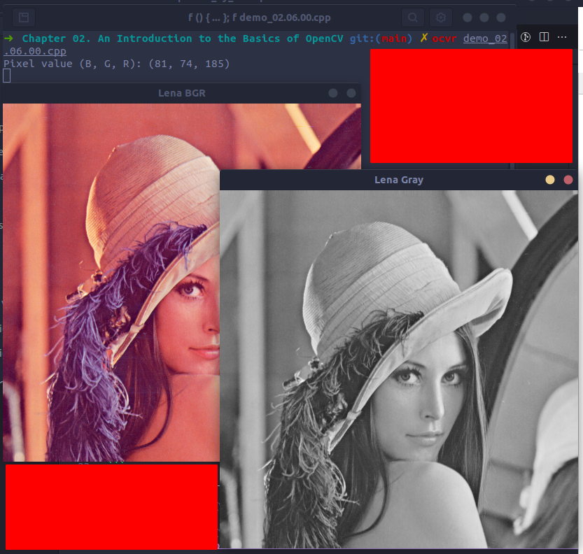

# 2.6. Reading/writing images
###### [demo_02.06.00.cpp](demo_02.06.00.cpp)
```cpp
#include <iostream>
#include <string>
#include <sstream>

#include <opencv4/opencv2/core.hpp>
#include <opencv4/opencv2/highgui.hpp>

using namespace cv;
using namespace std;

int main(int argc, const char** argv) {
    Mat color = imread("./data/lena.png");
    Mat gray = imread("./data/lena.png", 0);

    imwrite("./data/lena_gray.png", gray);

    int myRow = color.cols - 1;
    int myCol = color.rows - 1;

    Vec3b pixel = color.at<Vec3b>(myRow, myCol);

    cout << "Pixel value (B, G, R): (" << (int)pixel[0] << ", " << (int)pixel[1] << ", " << (int)pixel[2] << ")" << endl;

    imshow("Lena BGR", color);
    imshow("Lena Gray", gray);

    waitKey(0);
    return 0;
}
```


# 2.10. Basic data persistence and storage
## 2.10.1. Writing to a file storage
###### [demo_02.10.01.00.cpp](demo_02.10.01.00.cpp)
```cpp
#include <opencv4/opencv2/opencv.hpp>
using namespace cv;
using namespace std;

int main(int, char** argv) {
    // Create the writer
    FileStorage fs("./data/test.yml", FileStorage::WRITE);

    // Save an int
    int fps = 5;
    fs << "fps" << fps;

    // Create some mat sample
    Mat m1 = Mat::eye(2, 3, CV_32F);
    Mat m2 = Mat::ones(3, 2, CV_32F);
    Mat result = (m1 + 1).mul(m1 + 3);

    // Write the result
    fs << "Result" << result;

    // Release the file
    fs.release();
    
    FileStorage fs2("./data/test.yml", FileStorage::READ);
    Mat r;
    fs2["Result"] >> r;
    cout << r << endl;

    fs2.release();

    return 0;
}
```

