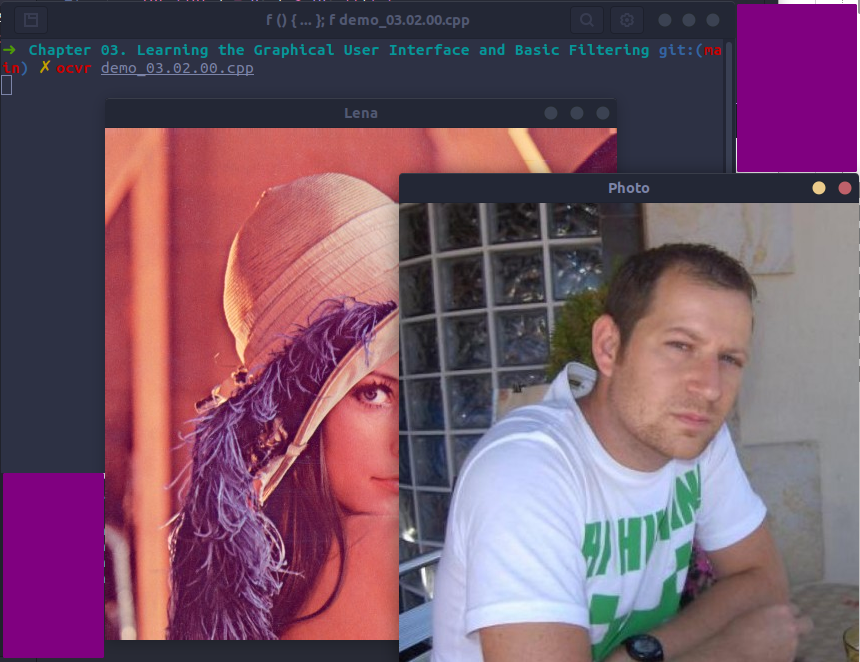

# 3.2. A basic graphical user interface with OpenCV
###### [demo_03.02.00.cpp](demo_03.02.00.cpp)
```cpp
#include <iostream>
#include <string>
#include <sstream>
using namespace std;

// OpenCV includes
#include <opencv4/opencv2/core.hpp>
#include <opencv4/opencv2/highgui.hpp>
using namespace cv;

const int CV_GUI_NORMAL = 0x10;

int main(int argc, const char** argv) {
    // Read images
    Mat lena = imread("./data/lena.jpg");
    Mat photo = imread("./data/photo.jpg");

    // Create windows
    namedWindow("Lena", CV_GUI_NORMAL);
    namedWindow("Photo", WINDOW_AUTOSIZE);

    // Move window
    moveWindow("Lena", 10, 10);
    moveWindow("Photo", 520, 10);

    // Show images
    imshow("Lena", lena);
    imshow("Photo", photo);

    // Resize window, only non autosize
    resizeWindow("Lena", 512, 512);

    // Wait for any key press
    waitKey(0);

    // Destroy the window
    destroyWindow("Lena");
    destroyWindow("Photo");

    // Create 10 windows
    for (int i = 0; i < 10; ++i) {
        ostringstream ss;
        ss << "Photo " << i;
        namedWindow(ss.str());
        moveWindow(ss.str(), 20*i, 20*i);
        imshow(ss.str(), photo);
    }

    waitKey(0);

    // Destroy all windows
    destroyAllWindows();
    return 0;
}
```
